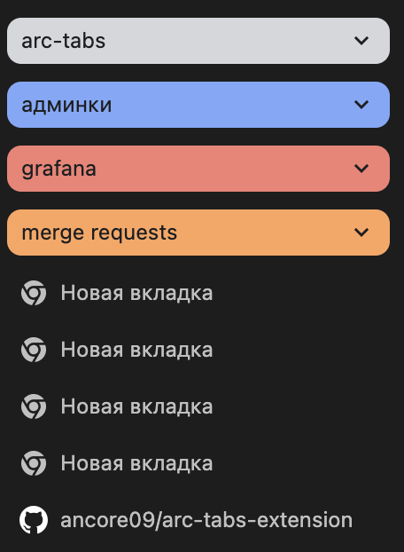
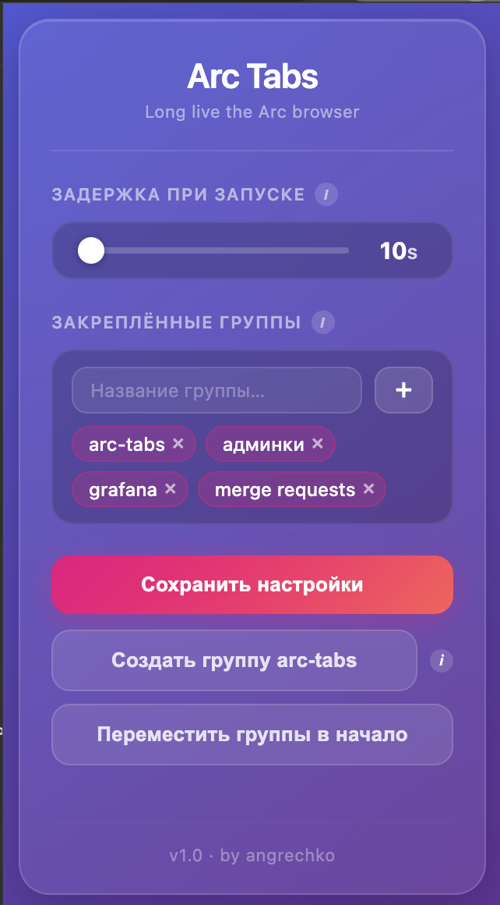

# arc-tabs

Расширение имитирует поведение Arc Browser в отношении открытия новых вкладок в Google Chrome

### Установка

1. Скачать бета версию хрома - там появилась нативная поддержка вертикальных вкладок. По идее этот функционал скоро заедет в стабильную версию
    - В chrome://flags/ включить vertical-tabs
    - В chrome://flags/ стоит выключить new-tab-adds-to-active-group
2. В chrome://extensions/ активировать режим разработчика
3. Скачать и распаковать или склонировать этот репозиторий
4. В chrome://extensions/ загрузить распакованное расширение, указав путь к папке с кодом расширения
5. Вы великолепны

### Аналогия с Arc

Для начала немного терминологии:
- Постоянные вкладки - закрепленные вкладки в Arc. В рамках этого расширения в Chrome закрепленными вкладками считаются группы вкладок в Chrome, которые находятся в самом верху панели вкладок
- Временные вкладки - вкладки в Arc, которые находятся под закрепленными (они автоматически архивируются Arc'ом). В рамках этого расширения в Chrome временными вкладками считаются также все вкладки ниже "закрепленных" групп вкладок в панели вкладок.

Пример:

Здесь постоянными вкладками считаются вкладки внутри групп arc-tabs, админки, grafana, merge requests.

Временными вкладками считаются все остальные вкладки.

### Что умеет расширение

- При открытии новой вкладки она перемещается на позицию сразу после последней закрепленной вкладки также как и в Arc - новая вкладка открывается в начале панели временных вкладок. При этом происходит автоматический скролл панели вкладок к новой открытой вкладке.
- Задержка активации расширения при старте Chrome.
Чтобы вкладки не перемещались во время открытия вкладок из предыдущей сессии, расширение отключается автоматически на настраеваемый интервал времени.
- Упорядочивание закрепленных групп вкладок. В расширении можно указать какие группы считать закрепленными. В этом случае для расчета позиции для открытия новой вкладки будут участвовать только указанные группы. Если группы не указаны - новая вкладка будет перемещаться в начало панели вкладок. Также если порядок закрепленных групп сбился - его можно восстановить кнопкой в расширении.

### Технические детали

#### Скролл к новой открытой вкладке

К сожалению, в Chrome нет встроенного API для управления скроллом панели вкладок. Поэтому для скролла используется грязный хак: при открытии новой вкладки фокус перемещается на самую первую вкладку в панели, это триггерит скролл наверх, далее фокус снова перемещается на новую открытую вкладку. Это происходит очень быстро, но странички все равно могут мограть. Чтобы сгладить моргание в расширении есть возможность создать группу вкладок arc-tabs, в которой всегда будет находиться пустая новая вкладка. Эта пустая вкладка будет использоваться для смены фокуса, и так как она выглядит точно также как и новая открываемая пустая вкладка - моргание не так заметно. При наличии группы с названием arc-tabs расширении отслеживает ее: перемещает наверх и пересоздает при удалении

### Использование

В расширении предусмотрен UI для настройки.

- Слайдер "Задержка при запуске" задает интервал, на время которого расширение не будет перемещать вкладки при открытии браузера и восстановлении предыдущей сессии.
- В "Закрепленных группах" указываются названия групп вкладок, которые будут считаться закрепленными. Только они будут участвовать в расчете позиции для новой открытой вкладки.
- Кнопка "Сохранить настройки" записывает настройки в storage браузера. Нужно нажимать ее после любых изменений.
- Кнопка "Создать группу arc-tabs" создает группу с пустой вкладой для грязного хака скролла панели вкладок. Необзательно это использовать, но рекомендуется, чтобы для скролла не использовалась какая-нибудь тяжелая вкладка. Рекомендуется всегда держать группу arc-tabs первой в списке закрепленных групп выше.
- Кнопка "Переместить группы в начало" перемещает закрепленные группы в начало в указаном порядке. Полезно, если по какой-то причине порядок нарушился.